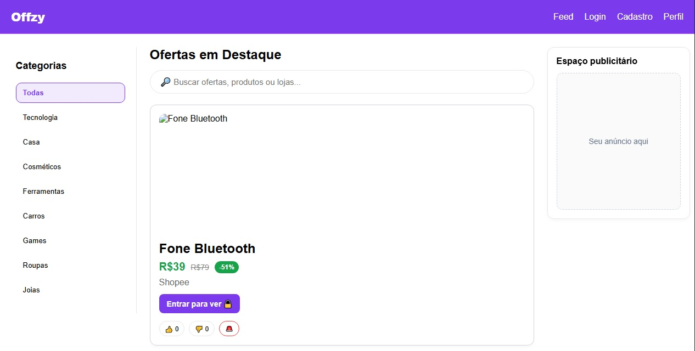
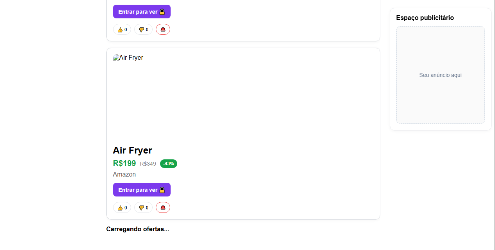
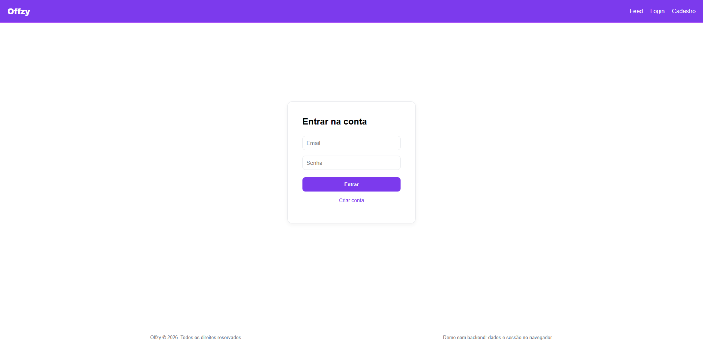
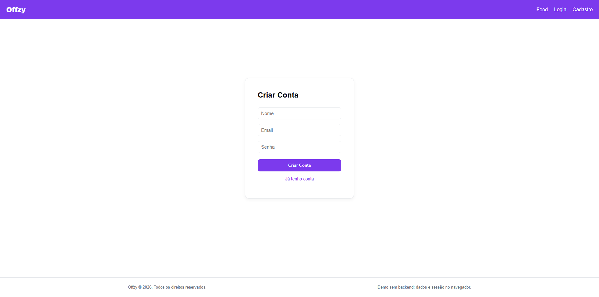
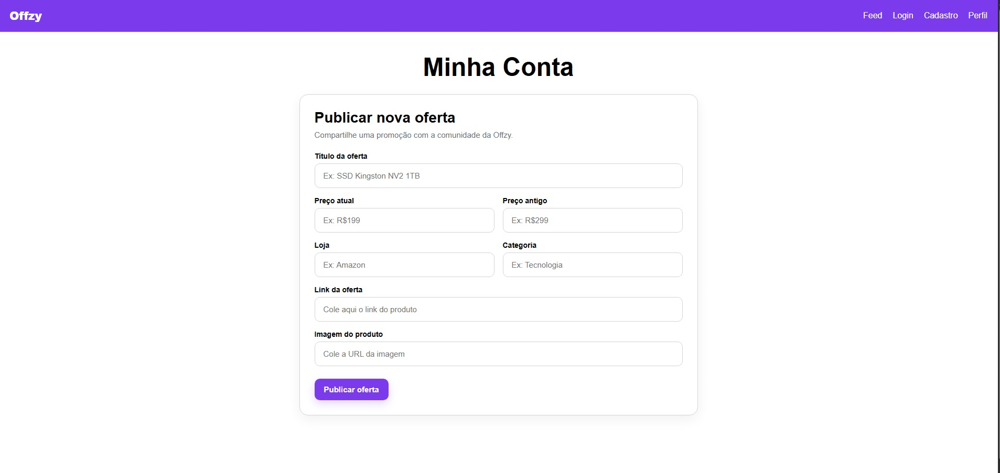

# 🚀 Offzy — Plataforma de Ofertas

Offzy é uma aplicação web moderna inspirada em plataformas como Pelando e Promobit, permitindo que usuários descubram, compartilhem e avaliem ofertas de forma simples e intuitiva.

O projeto foi desenvolvido com foco em **experiência do usuário, arquitetura limpa e interface moderna**.

---

## ✨ Funcionalidades

* 📱 Feed de ofertas com scroll infinito
* 🔎 Busca por produtos, lojas ou palavras-chave
* 🏷️ Filtro por categorias
* 👍 Sistema de votos (oferta boa / preço normal)
* 💰 Exibição de desconto (preço antigo vs atual)
* 📝 Publicação de novas ofertas
* 🔒 Bloqueio de acesso para usuários não logados
* 💾 Persistência de dados com localStorage
* 📐 Layout responsivo (desktop e mobile)

---

## 🛠️ Tecnologias utilizadas

* React
* JavaScript (ES6+)
* Vite
* React Router
* CSS moderno (variáveis + responsividade)

---

## 📸 Screenshots

### 🏠 Feed


### 🔄 Feed (outra visualização)


### 🔐 Login


### 📝 Cadastro


### 👤 Perfil / Publicar oferta


---

## 📁 Estrutura do projeto

```
src
 ├── components
 ├── pages
 ├── data
 ├── App.jsx
 ├── main.jsx
 └── index.css
```

---

## ⚙️ Como rodar o projeto

```bash
git clone https://github.com/brandaoca44/offzy-deals-app.git
cd offzy-deals-app
npm install
npm run dev
```

---

## 🎯 Objetivo

Este projeto foi desenvolvido como parte do meu portfólio com o objetivo de demonstrar:

* Estruturação de aplicações em React
* Gerenciamento de estado e fluxo de dados
* Construção de interfaces modernas e responsivas
* Criação de componentes reutilizáveis
* Aplicação de boas práticas de UI/UX

---

## 🚧 Próximas melhorias

* Autenticação real de usuários
* Integração com backend (API)
* Sistema de comentários
* Upload de imagens
* Captura automática de dados via link (scraping)

---

## 👨‍💻 Autor

Desenvolvido por **Caíque Brandão**

---
